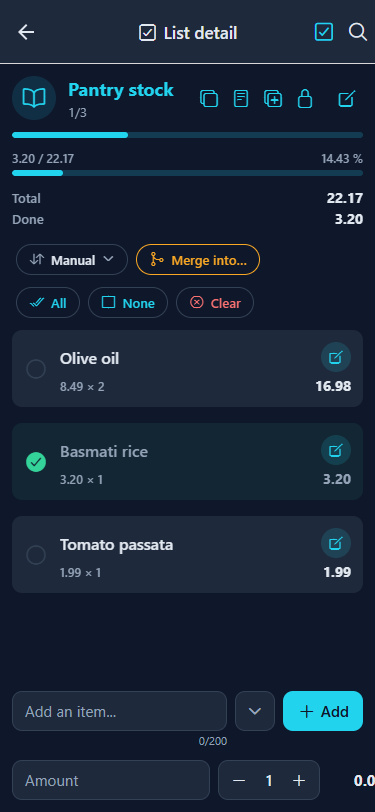

# Listly

[English](README.md) · [Español](README.es.md) · [Català](README.ca.md) · [Galego](README.gl.md) · [Euskara](README.eu.md) · [Français](README.fr.md) · [Português](README.pt.md) · [Italiano](README.it.md)

**Listly** ist ein Local-First-Listenmanager für den Alltag. Erstelle so viele Listen wie du brauchst — Einkauf, Aufgaben, Gepäck, Vorratskammer — organisiere sie in Sammlungen und hake die Einträge nach und nach ab. Listen können einfache Checklisten oder numerische Listen sein, die pro Eintrag einen Betrag und eine Menge mit laufender Summe erfassen.

Alles läuft **auf dem Gerät**: deine Daten liegen in einer lokalen SQLite-Datenbank (sql.js + IndexedDB im Web), nichts verlässt dein Telefon, und es ist kein Konto und kein Abo erforderlich.

| | |
|---|---|
| **Plattformen** | iOS, Android und Web |
| **Version** | 1.0.0 |
| **Sprachen** | Englisch, Spanisch, Katalanisch, Galicisch, Baskisch, Französisch, Deutsch, Portugiesisch, Italienisch |
| **Daten** | 100 % lokal (SQLite nativ, sql.js + IndexedDB im Web) |
| **Themes** | Dunkel, Hell und Automatisch (folgt dem System) |

## Funktionen

- **Listen** — erstelle so viele Listen wie du willst, jede mit eigenem Symbol und eigener Farbe, und wähle zwischen zwei Listenarten: **Standard** (Checkliste) oder **Numerisch**, mit einem Betrag und einer Menge pro Eintrag.
- **Einträge** — füge Einträge schnell über die untere Leiste hinzu, hake sie ab und öffne einen Eintrag, um eine **Notiz** oder ein **Foto** anzuhängen (Galerie auf allen Plattformen, Kamera unter iOS und Android).
- **Numerische Listen** — gib jedem Eintrag einen Betrag und eine Menge; der Listenkopf zeigt einen **Wertfortschrittsbalken** sowie **Gesamt** und die Zwischensumme **Erledigt**, und jeder Eintrag zeigt seine Zeilensumme (Betrag × Menge). Tippst du den Betrag eines Eintrags an, wenn er leer oder `0.00` ist, wird das Feld geleert, damit du einen Preis direkt eingeben kannst.
- **Sammlungen** — gruppiere Listen in Sammlungen (Ordner) wie *Zuhause* oder *Arbeit*, und ziehe eine Liste auf eine Sammlung, um sie hineinzulegen.
- **Drag & Drop** — sortiere Listen und Einträge per Langdrücken und Ziehen neu; gespeichert über eine Spalte `position`.
- **Gesperrte Listen** — schütze eine Liste mit einer Passphrase; ihre Einträge werden **auf dem Gerät** mit AES-256-GCM verschlüsselt. Wenn du die Passphrase vergisst, gibt es keine Wiederherstellung.
- **Duplizieren, Kopieren & Zusammenführen** — dupliziere eine ganze Liste, kopiere eine Liste mit oder ohne ihre Notizen, kopiere ausgewählte Einträge in eine andere Liste oder führe Einträge in eine andere Liste zusammen. Beim Kopieren einer numerischen Liste werden auch Betrag × Menge = Zeilensumme je Eintrag sowie die Gesamt-/Erledigt-Summen übernommen.
- **Sortierung** — sortiere eine Liste manuell, nach Name oder nach dem Zeitpunkt, an dem jeder Eintrag hinzugefügt wurde, auf- oder absteigend.
- **Auswahlmodus** — wechsle über den Kopf in den Auswahlmodus, um mehrere Einträge auszuwählen und zu löschen (oder mehrere Listen auf einmal auszuwählen).
- **Suche** — filtere Listen und Einträge über die Kopf-Suche auf Start, Listen und innerhalb einer Liste.
- **Einstellungen** — Theme, Textgröße, Sprache, Layouts pro Bildschirm (Raster oder Zeilen) und optionale Felder pro Listenart (Notizen und Fotos in der Eintragsansicht und im Bearbeiten-Bildschirm).
- **Datensicherung** — exportiere deine gesamte Datenbank als JSON-Snapshot und importiere sie jederzeit zurück, mit abgesicherten Aktionen zum vollständigen Löschen und zum Zurücksetzen auf Werkseinstellungen.

## Screenshots

<br>*Startbildschirm, bevor eine Sammlung oder Liste existiert.*<br><br>
<br>*Start mit einer Sammlung und eigenständigen Listen, darunter eine gesperrte Liste.*<br><br>
<br>*Seitenmenü mit Start, Sammlungen, Listen und Einstellungen — und der App-Version unten.*<br><br>
<br>*Eine Liste erstellen: Name, Art (Standard oder Numerisch), Symbol und Farbe.*<br><br>
<br>*Eine Standardliste mit abgehakten Einträgen, einer Notiz, Sortiersteuerung und Stapelaktionen.*<br><br>
<br>*Eine numerische Liste mit einem Wertfortschrittsbalken, Gesamt und Erledigt, Zeilensummen und der Betrag/Menge-Zeile.*<br><br>
<br>*Die ausgeklappte Hinzufügen-Leiste, um dem neuen Eintrag eine Notiz und Fotos anzuhängen.*<br><br>
<br>*Einen Eintrag bearbeiten: Name, Notiz und Fotos.*<br><br>
<br>*Der Sammlungen-Bildschirm.*<br><br>
<br>*Der Listen-Bildschirm mit Sammlungszugehörigkeit und Fortschritt pro Liste.*<br><br>
<br>*Eine Sammlung mit ihren Mitgliedslisten.*<br><br>
<br>*Eine Liste mit einer Passphrase sperren.*<br><br>
<br>*Eine gesperrte Liste, die auf die Passphrase wartet.*<br><br>
<br>*Auswahlmodus mit der unteren Aktionsleiste.*<br><br>
<br>*Einstellungen: Erscheinungsbild, Regional, Personalisierung und Daten.*<br><br>
<br>*Erscheinungsbild: Theme und Textgröße.*<br><br>
<br>*Die Sprachauswahl mit allen neun Sprachen und ihren Flaggen.*<br><br>
<br>*Regionale Einstellungen: Sprache.*<br><br>
<br>*Personalisierung: Layouts pro Bildschirm und optionale Felder pro Listenart.*<br><br>
<br>*Daten: Export/Import und die abgesicherten Lösch- und Zurücksetzen-Aktionen.*<br><br>

## Technologien

| Schicht | Technologie |
|---|---|
| Framework | React Native mit Expo (SDK 57) |
| Sprache | TypeScript |
| Navigation | React Navigation (Stack + Drawer) |
| Symbole | @expo/vector-icons (Ionicons) |
| Drag & Drop | react-native-sortables |
| Farbwähler | reanimated-color-picker |
| Verschlüsselung | quick-crypto (AES-256-GCM für gesperrte Listen) |
| Persistenz | SQLite (expo-sqlite) nativ, sql.js (WASM) + IndexedDB im Web |
| ORM | Drizzle ORM (Query-Builder über ein gemeinsames `DatabaseHandle`) |
| Validierung | Zod-Schemas als einzige Quelle der Wahrheit für gespeicherte Zeilen |
| Web | react-native-web |
| State | Context API (AppContext + ConfigContext) |
| i18n | Eigenes System (en, es, ca, gl, eu, fr, de, pt, it) |

## Entwicklung

Dieser Abschnitt ist für Mitwirkende und alle, die die App ausführen, forken oder erweitern möchten.

### Voraussetzungen

- Node.js 20+ (Node 24 empfohlen)
- npm
- Ein optionaler Android-Emulator (der Ordner `android/` wird von CNG erzeugt — siehe unten)

### Erstmalig nach dem Klonen

```bash
cd ListlyApp
npm install
npx expo start
```

Dies startet Metro Bundler. Danach:

| Zum Anzeigen im… | Tue dies |
|---|---|
| **Browser** | Öffne http://localhost:8081 oder führe `npx expo start --web` aus |
| **Android (Emulator)** | Führe `npx expo run:android` aus |
| **iOS (Simulator)** | Führe `npx expo run:ios` aus (nur macOS) |

> Hinweis: gesperrte Listen und das Teilen-Blatt hängen von nativen Modulen ab, verwende daher einen Entwicklungs- oder Release-Build statt Expo Go.

### Befehle

| Befehl | Beschreibung |
|---|---|
| `npm start` | Startet Expo im Entwicklungsmodus |
| `npm run web` | Startet und öffnet im Browser |
| `npm run android` | Startet auf dem Android-Emulator |
| `npm run ios` | Startet auf dem iOS-Simulator (nur macOS) |
| `npm run typecheck` | TypeScript-Prüfung (`tsc --noEmit`) |
| `npm run lint` | ESLint über `expo lint` |
| `npm test` | Führt die Vitest-Suite aus |
| `npm run test:watch` | Führt Vitest im Watch-Modus aus |
| `npm run test:all` | typecheck + lint + tests (das vollständige lokale Gate) |

### Tests

- **Unit / Integration** — Vitest. Die Suite deckt die Datenbank-Repositories auf beiden SQLite-Backends (nativ + sql.js), Backup-Rundläufe, Verschlüsselung und mit `@testing-library/react-native` gerenderte Komponenten ab.
- **Web-Verifikation** — die Akzeptanzkriterien jeder Funktion werden in einem echten Browser bei 375px mit Playwright verifiziert.
- Die CI-Pipeline führt das vollständige Gate `npm run test:all` bei jedem Push und Pull Request nach `develop` und `main` aus.

> **Lokales Gate:** eine Änderung ist erst fertig, wenn `npm run test:all` durchläuft.

### Projektstruktur

```
ListlyApp/
  src/
    components/    — wiederverwendbare UI-Komponenten
    constants/     — Themes, Typen, Farben, Symbole
    context/       — AppContext, ConfigContext (globaler Zustand)
    database/      — SQLite/sql.js-Engines, Repositories, Migrationen, Drizzle-Schema
    hooks/         — eigene Hooks
    i18n/          — Übersetzungen (en, es, ca, gl, eu, fr, de, pt, it)
    navigation/    — AppNavigator (Drawer + Stack)
    screens/       — Bildschirmkomponenten (PascalCase)
    utils/         — Formatierer, Plattform, Sprache
```

### Datenbank

- Eine einzige Engine-Schnittstelle (`DatabaseHandle`) auf allen Plattformen: expo-sqlite nativ, sql.js (WASM) mit IndexedDB-Persistenz im Web.
- Das Schema wird aus einem kanonischen `createSchema` erstellt und mit `PRAGMA user_version` versioniert; Migrationen laufen einmal, innerhalb einer Transaktion.
- Repositories werden mit dem Drizzle-Query-Builder über das gemeinsame Handle geschrieben; gespeicherte Zeilen werden mit Zod-Schemas validiert.
- Im Web werden die exportierten SQLite-Bytes in IndexedDB persistiert, sodass dieselben Daten Neuladungen überdauern.

### Einen Android-APK / AAB erstellen (EAS Build)

**Listly** nutzt EAS Build, das den Android-Signaturschlüssel verwaltet, sodass aufeinanderfolgende Versionen dieselbe Signatur teilen und sich direkt aktualisieren. Erfordert ein Expo-Konto und die EAS CLI:

```bash
npm install -g eas-cli
eas login
cd ListlyApp
```

| Profil | Befehl | Ausgabe |
|---|---|---|
| Development | `eas build --profile development` | dev-client-Build (intern) |
| Preview | `eas build --platform android --profile preview` | installierbarer APK (intern) |
| Production | `eas build --platform android --profile production --no-wait` | veröffentlichbarer AAB (Store) |

Das `production`-Profil in `eas.json` verwendet `"distribution": "store"` und `"buildType": "app-bundle"` und erzeugt ein AAB für die Store-Einreichung. `cli.appVersionSource` ist `"local"`, daher werden die Versionsmetadaten direkt aus `app.json` gelesen — **erhöhe bei jeder Version `android.versionCode` (Ganzzahl, streng steigend) und `ios.buildNumber`**. EAS erzeugt und speichert den Release-Signaturschlüssel beim ersten Production-Build; sichere ihn mit `eas credentials` und committe ihn nie (Schlüssel sind in .gitignore).

Für einen schnellen lokalen Test kannst du weiterhin einen debug-signierten APK aus dem generierten nativen Ordner bauen (andere, Debug-Signatur — nicht zur Verteilung):

```bash
cd ListlyApp
npx expo prebuild --platform android   # natives Projekt nach Assets-/Konfig-Änderungen neu erzeugen
cd android
./gradlew assembleRelease   # APK → app/build/outputs/apk/release/app-release.apk
```

### Methodik

Dieses Projekt verwendet **Specification-Driven Development (SDD).** Die Spezifikationen liegen in `spec/` und sind die einzige Quelle der Wahrheit — was gebaut werden soll, wird zuerst in `1-spec.md`-Dokumenten definiert, dann implementiert und schließlich gegen die Akzeptanzkriterien verifiziert. Die Roadmap wird in `spec/constitution/3-roadmap.md` geführt.

## Lizenz

Listly steht unter der MIT-Lizenz — siehe die Datei [LICENSE](LICENSE).
