# Listly

[English](README.md) · [Català](README.ca.md) · [Galego](README.gl.md) · [Euskara](README.eu.md) · [Français](README.fr.md) · [Deutsch](README.de.md) · [Português](README.pt.md) · [Italiano](README.it.md)

**Listly** es un gestor de listas local-first para el día a día. Crea tantas listas como necesites — compra, tareas, equipaje, despensa — organízalas en colecciones y ve marcando los elementos a medida que avanzas. Las listas pueden ser listas de comprobación simples o listas numéricas que registran un importe y una cantidad por elemento con un total acumulado.

Todo funciona **en el dispositivo**: tus datos viven en una base de datos SQLite local (sql.js + IndexedDB en la web), nada sale de tu teléfono y no necesitas cuenta ni suscripción.

| | |
|---|---|
| **Plataformas** | iOS, Android y Web |
| **Versión** | 1.0.0 |
| **Idiomas** | Inglés, Español, Catalán, Gallego, Euskera, Francés, Alemán, Portugués e Italiano |
| **Datos** | 100 % locales (SQLite en nativo, sql.js + IndexedDB en web) |
| **Temas** | Oscuro, Claro y Automático (sigue el sistema) |

## Funciones

- **Listas** — crea tantas listas como quieras, cada una con su propio icono y color, y elige entre dos tipos de lista: **Estándar** (de comprobación) o **Numérica**, con un importe y una cantidad por elemento.
- **Elementos** — añade elementos rápidamente desde la barra inferior, márcalos y abre un elemento para añadir una **nota** o una **foto** (galería en todas las plataformas, cámara en iOS y Android).
- **Listas numéricas** — asigna a cada elemento un importe y una cantidad; la cabecera de la lista muestra el **Total** y el subtotal **Hecho**, y cada elemento muestra su total de línea (importe × cantidad).
- **Colecciones** — agrupa listas en colecciones (carpetas) como *Casa* o *Trabajo*, y arrastra una lista sobre una colección para moverla dentro.
- **Arrastrar y soltar** — reordena listas y elementos manteniendo pulsado y arrastrando; se guarda mediante una columna `position`.
- **Listas bloqueadas** — protege una lista con una contraseña; sus elementos se cifran **en el dispositivo** con AES-256-GCM. Si olvidas la contraseña, no hay recuperación.
- **Duplicar, copiar y fusionar** — duplica una lista entera, copia una lista con o sin sus notas, copia los elementos seleccionados a otra lista o fusiona elementos en otra lista.
- **Ordenación** — ordena una lista manualmente, por nombre o por el momento en que se añadió cada elemento, de forma ascendente o descendente.
- **Modo selección** — entra en modo selección desde la cabecera para seleccionar varios elementos y eliminarlos (o seleccionar varias listas a la vez) de una sola vez.
- **Búsqueda** — filtra listas y elementos desde la búsqueda de la cabecera en Inicio, Listas y dentro de una lista.
- **Ajustes** — tema, tamaño del texto, idioma, diseños por pantalla (cuadrícula o filas) y campos opcionales por tipo de lista (notas y fotos en la vista del elemento y en la pantalla de edición).
- **Copia de seguridad** — exporta toda tu base de datos como un archivo JSON e impórtala de nuevo cuando quieras, con acciones protegidas de borrado total y restablecimiento de fábrica.

## Capturas de pantalla

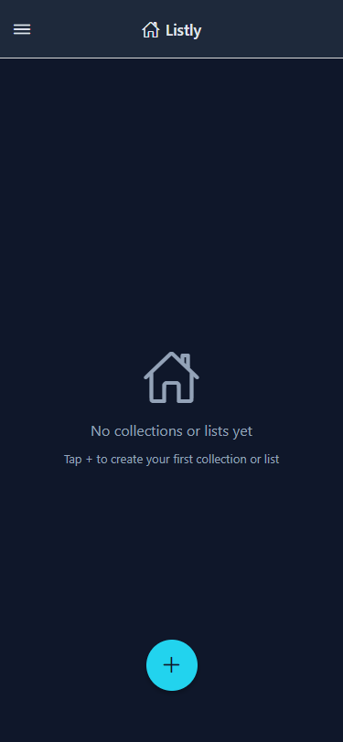<br>*Pantalla de inicio antes de que exista ninguna colección o lista.*<br><br>
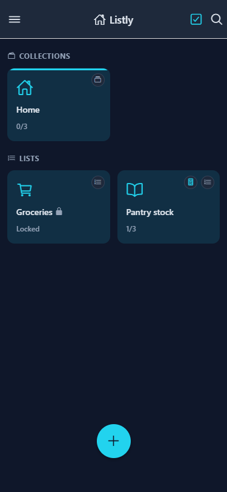<br>*Inicio con una colección y listas sueltas, incluida una lista bloqueada.*<br><br>
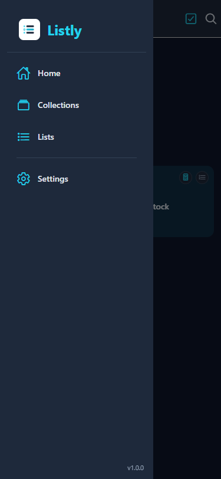<br>*Menú lateral con Inicio, Colecciones, Listas y Ajustes — y la versión de la app abajo.*<br><br>
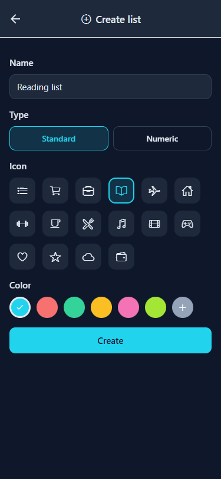<br>*Crear una lista: nombre, tipo (Estándar o Numérica), icono y color.*<br><br>
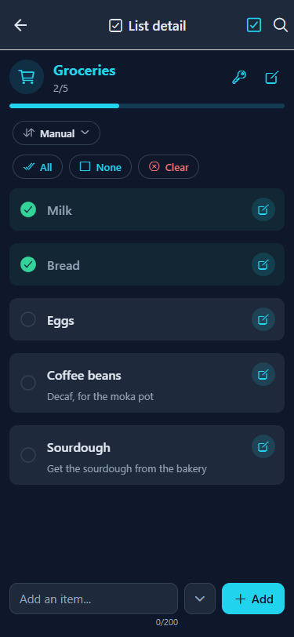<br>*Una lista estándar con elementos marcados, una nota, el control de orden y acciones por lotes.*<br><br>
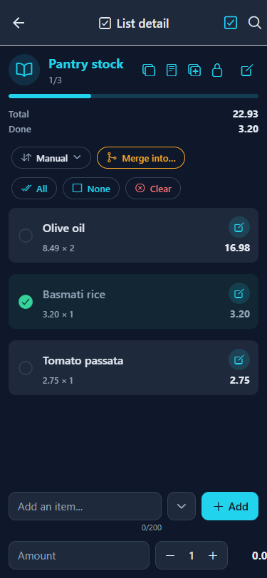<br>*Una lista numérica con Total y Hecho, totales de línea y la fila de importe/cantidad.*<br><br>
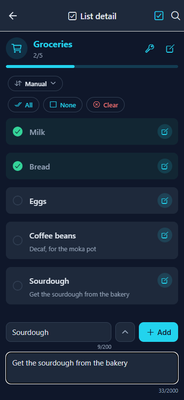<br>*La barra de añadir ampliada para adjuntar una nota y fotos al nuevo elemento.*<br><br>
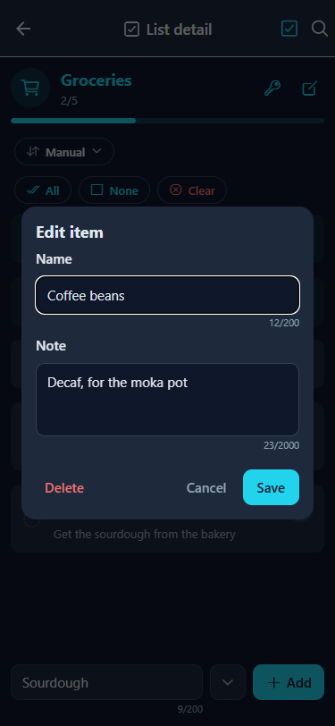<br>*Editar un elemento: nombre, nota y fotos.*<br><br>
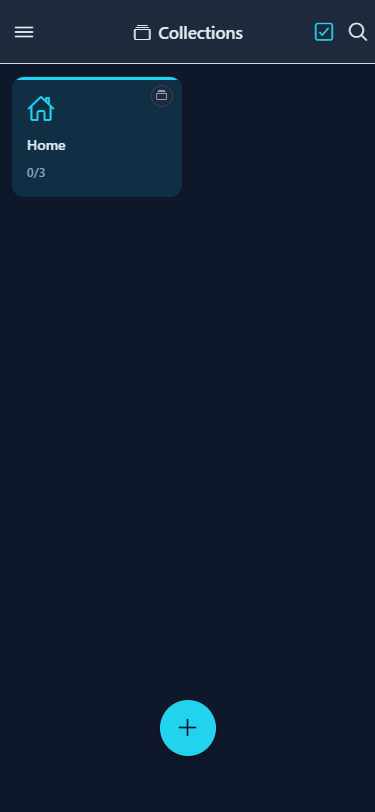<br>*La pantalla de Colecciones.*<br><br>
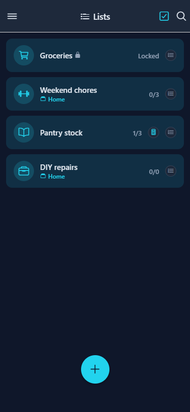<br>*La pantalla de Listas, con la pertenencia a colecciones y el progreso por lista.*<br><br>
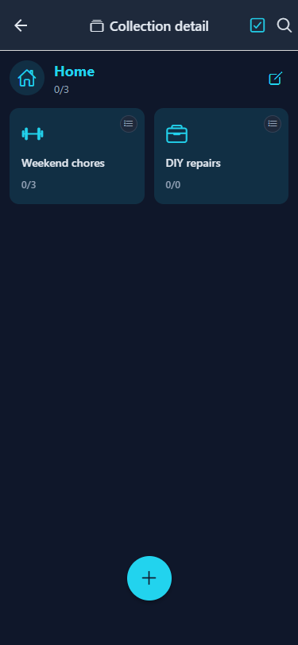<br>*Una colección con sus listas miembro.*<br><br>
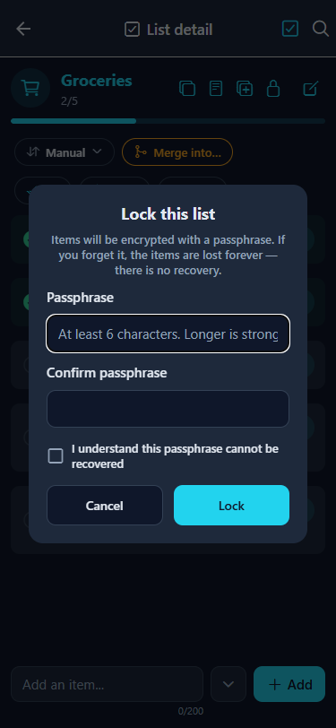<br>*Bloquear una lista con una contraseña.*<br><br>
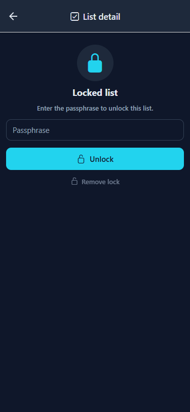<br>*Una lista bloqueada, esperando la contraseña.*<br><br>
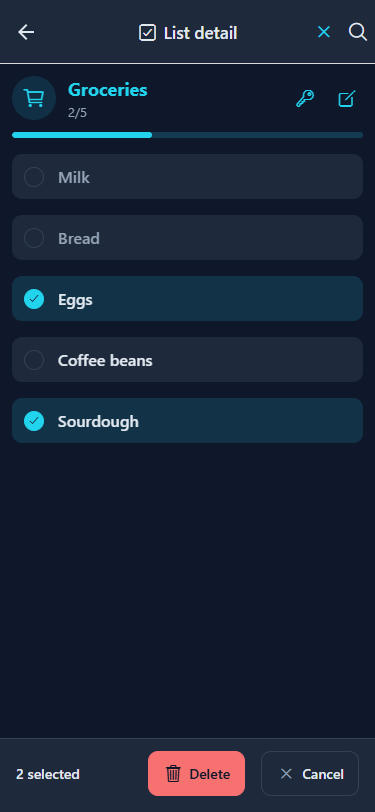<br>*Modo selección con la barra de acciones inferior.*<br><br>
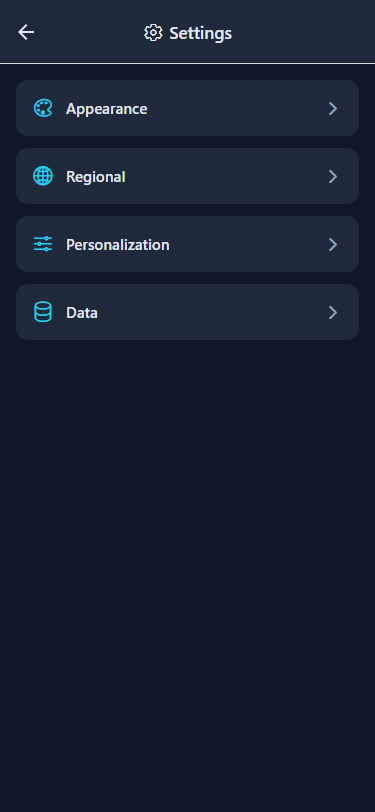<br>*Ajustes: Apariencia, Regional, Personalización y Datos.*<br><br>
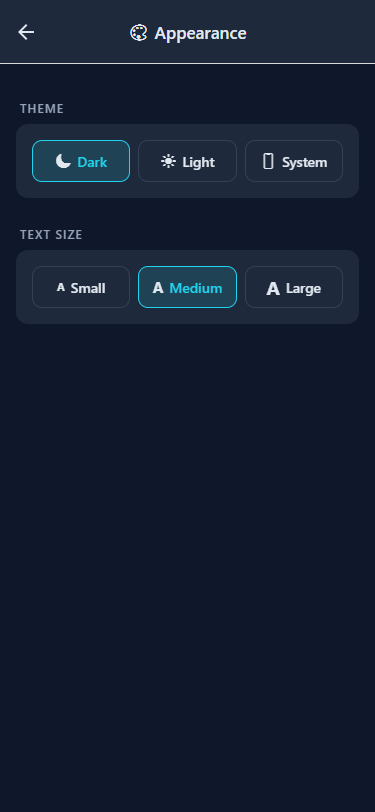<br>*Apariencia: tema y tamaño del texto.*<br><br>
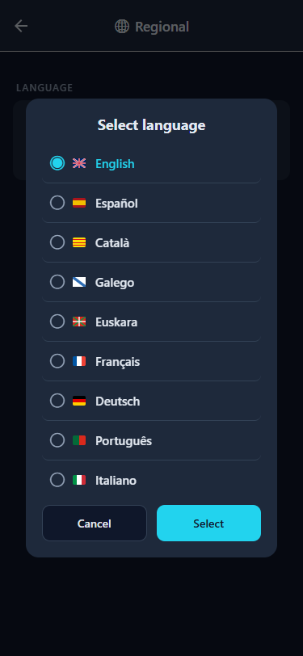<br>*El selector de idioma con los nueve idiomas y sus banderas.*<br><br>
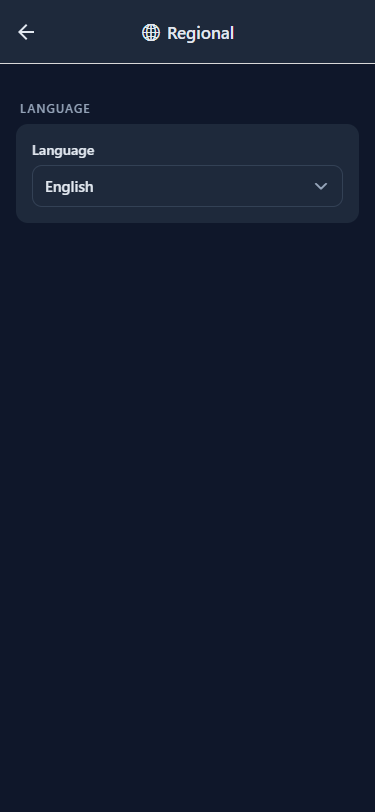<br>*Ajustes regionales: idioma.*<br><br>
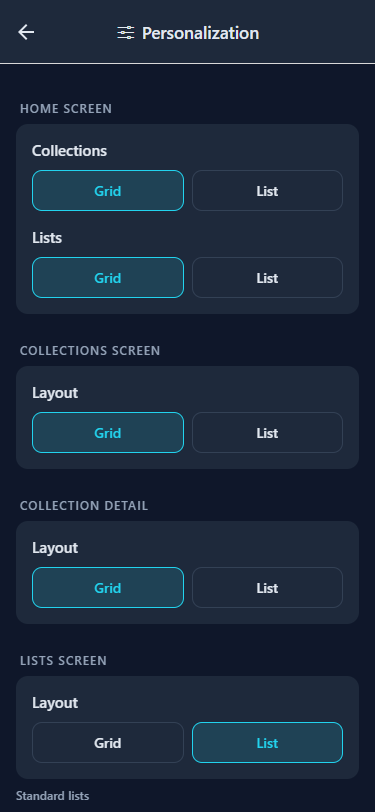<br>*Personalización: diseños por pantalla y campos opcionales por tipo de lista.*<br><br>
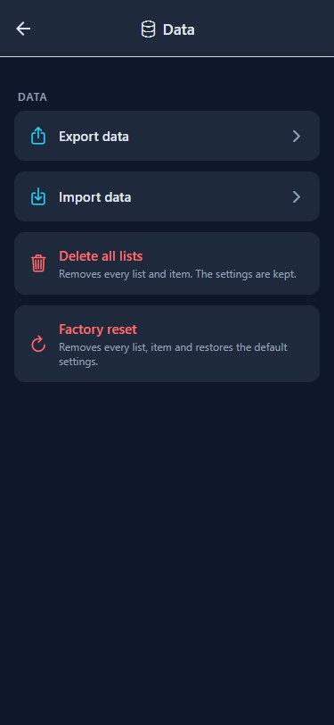<br>*Datos: exportar/importar y las acciones protegidas de borrado y restablecimiento.*<br><br>

## Tecnologías

| Capa | Tecnología |
|---|---|
| Framework | React Native con Expo (SDK 57) |
| Lenguaje | TypeScript |
| Navegación | React Navigation (Stack + Drawer) |
| Iconos | @expo/vector-icons (Ionicons) |
| Arrastrar y soltar | react-native-sortables |
| Selector de color | reanimated-color-picker |
| Cifrado | quick-crypto (AES-256-GCM para las listas bloqueadas) |
| Persistencia | SQLite (expo-sqlite) en nativo, sql.js (WASM) + IndexedDB en web |
| ORM | Drizzle ORM (query builder sobre un `DatabaseHandle` compartido) |
| Validación | Esquemas Zod como única fuente de verdad para las filas almacenadas |
| Web | react-native-web |
| Estado | Context API (AppContext + ConfigContext) |
| i18n | Sistema propio (en, es, ca, gl, eu, fr, de, pt, it) |

## Desarrollo

Esta sección es para colaboradores y para cualquiera que quiera ejecutar, hacer un fork o ampliar la app.

### Requisitos

- Node.js 20+ (se recomienda Node 24)
- npm
- Un emulador de Android opcional (la carpeta `android/` la genera CNG — ver abajo)

### La primera vez tras clonar

```bash
cd ListlyApp
npm install
npx expo start
```

Esto arranca Metro Bundler. Después:

| Para verlo en… | Haz esto |
|---|---|
| **Navegador** | Abre http://localhost:8081 o ejecuta `npx expo start --web` |
| **Android (emulador)** | Ejecuta `npx expo run:android` |
| **iOS (simulador)** | Ejecuta `npx expo run:ios` (solo macOS) |

> Nota: las listas bloqueadas y la hoja de compartir dependen de módulos nativos, así que usa una compilación de desarrollo o de release en lugar de Expo Go.

### Comandos

| Comando | Descripción |
|---|---|
| `npm start` | Arranca Expo en modo desarrollo |
| `npm run web` | Arranca y abre en el navegador |
| `npm run android` | Arranca en el emulador de Android |
| `npm run ios` | Arranca en el simulador de iOS (solo macOS) |
| `npm run typecheck` | Comprobación de TypeScript (`tsc --noEmit`) |
| `npm run lint` | ESLint mediante `expo lint` |
| `npm test` | Ejecuta la suite de Vitest |
| `npm run test:watch` | Ejecuta Vitest en modo watch |
| `npm run test:all` | typecheck + lint + tests (la puerta local completa) |

### Pruebas

- **Unitarias / de integración** — Vitest. La suite cubre los repositorios de la base de datos en ambos backends de SQLite (nativo + sql.js), los ciclos de copia de seguridad, el cifrado y componentes renderizados con `@testing-library/react-native`.
- **Verificación web** — los criterios de aceptación de cada función se verifican en un navegador real a 375px con Playwright.
- El pipeline de CI ejecuta la puerta completa `npm run test:all` en cada push y pull request a `develop` y `main`.

> **Puerta local:** un cambio solo está terminado cuando `npm run test:all` pasa.

### Estructura del proyecto

```
ListlyApp/
  src/
    components/    — componentes de UI reutilizables
    constants/     — temas, tipos, colores, iconos
    context/       — AppContext, ConfigContext (estado global)
    database/      — motores SQLite/sql.js, repositorios, migraciones, esquema Drizzle
    hooks/         — hooks propios
    i18n/          — traducciones (en, es, ca, gl, eu, fr, de, pt, it)
    navigation/    — AppNavigator (Drawer + Stack)
    screens/       — componentes de pantalla (PascalCase)
    utils/         — formateadores, plataforma, idioma
```

### Base de datos

- Una única interfaz de motor (`DatabaseHandle`) en todas las plataformas: expo-sqlite en nativo, sql.js (WASM) con persistencia en IndexedDB en web.
- El esquema se crea desde un `createSchema` canónico y se versiona con `PRAGMA user_version`; las migraciones se ejecutan una vez, dentro de una transacción.
- Los repositorios se escriben con el query builder de Drizzle sobre el handle compartido; las filas almacenadas se validan con esquemas Zod.
- En web los bytes exportados de SQLite se persisten en IndexedDB, así que los mismos datos sobreviven a las recargas.

### Compilar un APK de Android

La carpeta nativa `android/` la genera Expo CNG (`expo prebuild`) y no se versiona:

```bash
cd ListlyApp
npx expo prebuild --platform android
cd android
./gradlew assembleRelease   # APK → app/build/outputs/apk/release/app-release.apk
```

Ejecuta `npx expo prebuild --platform android` de nuevo siempre que cambien `assets/` o la configuración de icono/splash en `app.json`, de lo contrario el APK conserva los iconos antiguos.

### Metodología

Este proyecto usa **Specification-Driven Development (SDD).** Las especificaciones viven en `spec/` y son la única fuente de verdad — lo que hay que construir se define primero en documentos `1-spec.md`, luego se implementa y después se verifica contra los criterios de aceptación. La hoja de ruta se sigue en `spec/constitution/3-roadmap.md`.

## Licencia

Listly está bajo la licencia MIT — consulta el archivo [LICENSE](LICENSE).
