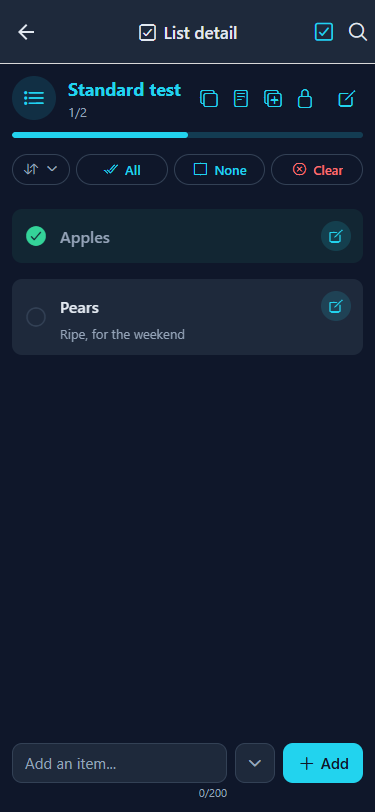
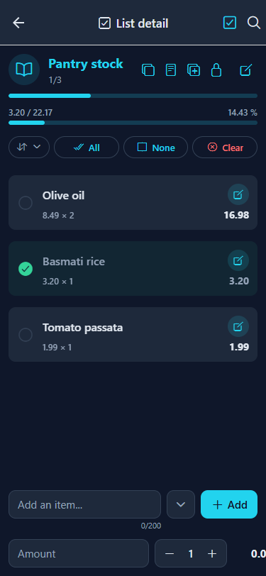
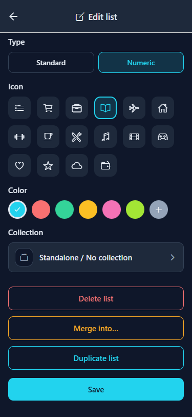
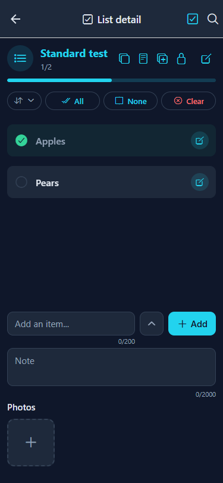
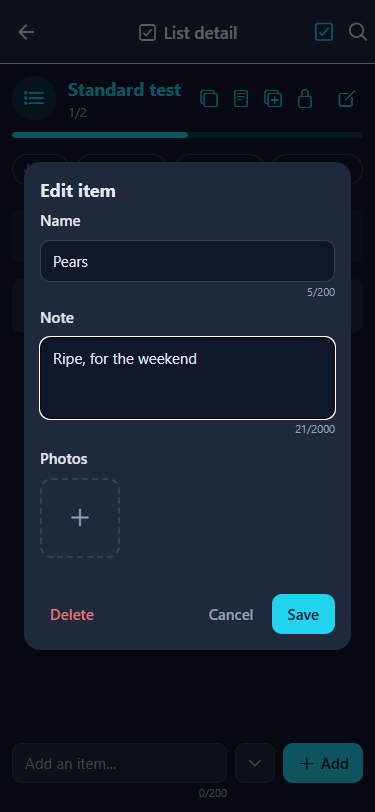
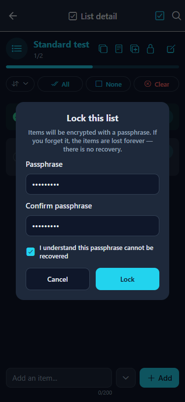
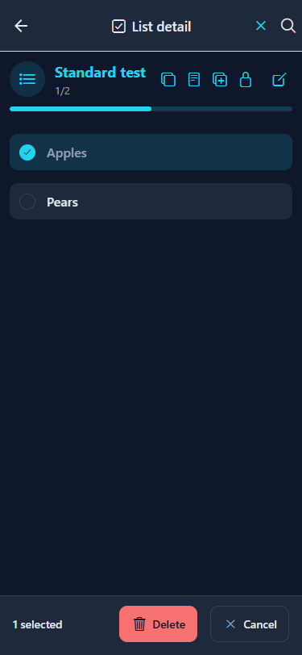

# Listly

[English](README.md) · [Español](README.es.md) · [Català](README.ca.md) · [Galego](README.gl.md) · [Euskara](README.eu.md) · [Français](README.fr.md) · [Deutsch](README.de.md) · [Italiano](README.it.md)

**Listly** é um gestor de listas local-first para o dia a dia. Cria tantas listas quantas precisares — compras, tarefas, bagagem, despensa — organiza-as em coleções e vai marcando os itens à medida que avanças. As listas podem ser listas de verificação simples ou listas numéricas que registam um valor e uma quantidade por item com um total acumulado.

Tudo funciona **no dispositivo**: os teus dados vivem numa base de dados SQLite local (sql.js + IndexedDB na web), nada sai do teu telefone e não é necessária conta nem subscrição.

| | |
|---|---|
| **Plataformas** | iOS, Android e Web |
| **Versão** | 1.0.0 |
| **Idiomas** | Inglês, Espanhol, Catalão, Galego, Basco, Francês, Alemão, Português e Italiano |
| **Dados** | 100 % locais (SQLite em nativo, sql.js + IndexedDB na web) |
| **Temas** | Escuro, Claro e Automático (segue o sistema) |

## Funcionalidades

- **Listas** — cria tantas listas quantas quiseres, cada uma com o seu ícone e cor, e escolhe entre dois tipos de lista: **Padrão** (lista de verificação) ou **Numérica**, com um valor e uma quantidade por item.
- **Itens** — adiciona itens rapidamente pela barra inferior, marca-os e abre um item para adicionar uma **nota** ou uma **foto** (galeria em todas as plataformas, câmara em iOS e Android).
- **Listas numéricas** — atribui a cada item um valor e uma quantidade; o cabeçalho da lista mostra uma **barra de progresso por valor** (sempre visível, p. ex. `3.20 / 22.17 · 14.43 %`) e cada item mostra o seu total de linha (valor × quantidade). Tocar no valor de um item quando está vazio ou a `0.00` limpa o campo para poderes escrever um preço diretamente.
- **Coleções** — agrupa listas em coleções (pastas) como *Casa* ou *Trabalho*, e arrasta uma lista para cima de uma coleção para a mover para lá.
- **Arrastar e largar** — reordena listas e itens com toque longo e arrasto; guardado através de uma coluna `position`.
- **Listas bloqueadas** — protege uma lista com uma palavra-passe; os seus itens são cifrados **no dispositivo** com AES-256-GCM. Se esqueceres a palavra-passe, não há recuperação.
- **Duplicar, copiar e fundir** — duplica uma lista inteira, copia uma lista com ou sem as suas notas, copia os itens selecionados para outra lista, ou funde itens noutra lista. Ao copiar uma lista numérica também se inclui o valor × quantidade = total de cada item e as somas Total/Feito.
- **Ordenação** — ordena uma lista manualmente, por nome ou pelo momento em que cada item foi adicionado, de forma ascendente ou descendente.
- **Modo de seleção** — entra em modo de seleção pelo cabeçalho para selecionar vários itens e eliminá-los (ou selecionar várias listas de uma vez) de uma só vez.
- **Pesquisa** — filtra listas e itens através da pesquisa do cabeçalho no Início, Listas e dentro de uma lista.
- **Definições** — tema, tamanho do texto, idioma, layouts por ecrã (grelha ou linhas) e campos opcionais por tipo de lista (notas e fotos na vista do item e no ecrã de edição).
- **Cópia de segurança** — exporta toda a base de dados como um ficheiro JSON e importa-a novamente quando quiseres, com ações protegidas de eliminação total e reposição de fábrica.

## Capturas de ecrã

<br>*Ecrã inicial antes de existir qualquer coleção ou lista.*<br><br>
<br>*Início com uma coleção e listas isoladas, incluindo uma lista bloqueada.*<br><br>
<br>*Menu lateral com Início, Coleções, Listas e Definições — e a versão da app em baixo.*<br><br>
<br>*Criar uma lista: nome, tipo (Padrão ou Numérica), ícone e cor.*<br><br>
<br>*Uma lista padrão com itens marcados, uma nota, o controlo de ordenação e as ações em lote — o cabeçalho fica fixo durante o deslocamento.*<br><br>
<br>*Uma lista numérica com uma barra de progresso por valor, totais de linha e a linha de valor/quantidade.*<br><br>
<br>*O ecrã Editar lista: renomear, alterar o tipo, o ícone e a cor, mover a lista para uma coleção, e Duplicar, Combinar ou Eliminar a lista.*<br><br>
<br>*A barra de adicionar expandida para anexar uma nota e fotos ao novo item.*<br><br>
<br>*Editar um item: nome, nota e fotos.*<br><br>
<br>*O ecrã de Coleções.*<br><br>
<br>*O ecrã de Listas, mostrando a pertença a coleções e o progresso por lista.*<br><br>
<br>*Uma coleção com as suas listas membros.*<br><br>
<br>*Bloquear uma lista com uma palavra-passe.*<br><br>
<br>*Uma lista bloqueada, à espera da palavra-passe.*<br><br>
<br>*Modo de seleção com a barra de ações inferior.*<br><br>
<br>*Definições: Aparência, Regional, Personalização e Dados.*<br><br>
<br>*Aparência: tema e tamanho do texto.*<br><br>
<br>*O seletor de idioma com os nove idiomas e as suas bandeiras.*<br><br>
<br>*Definições regionais: idioma.*<br><br>
<br>*Personalização: layouts por ecrã e campos opcionais por tipo de lista.*<br><br>
<br>*Dados: exportar/importar e as ações protegidas de eliminação e reposição.*<br><br>

## Tecnologias

| Camada | Tecnologia |
|---|---|
| Framework | React Native com Expo (SDK 57) |
| Linguagem | TypeScript |
| Navegação | React Navigation (Stack + Drawer) |
| Ícones | @expo/vector-icons (Ionicons) |
| Arrastar e largar | react-native-sortables |
| Seletor de cor | reanimated-color-picker |
| Cifra | quick-crypto (AES-256-GCM para listas bloqueadas) |
| Persistência | SQLite (expo-sqlite) em nativo, sql.js (WASM) + IndexedDB na web |
| ORM | Drizzle ORM (query builder sobre um `DatabaseHandle` partilhado) |
| Validação | Esquemas Zod como única fonte de verdade para as linhas guardadas |
| Web | react-native-web |
| Estado | Context API (AppContext + ConfigContext) |
| i18n | Sistema próprio (en, es, ca, gl, eu, fr, de, pt, it) |

## Desenvolvimento

Esta secção é para colaboradores e para quem quiser executar, fazer fork ou ampliar a app.

### Requisitos

- Node.js 20+ (Node 24 recomendado)
- npm
- Um emulador de Android opcional (a pasta `android/` é gerada pelo CNG — ver abaixo)

### Pela primeira vez após clonar

```bash
cd ListlyApp
npm install
npx expo start
```

Isto inicia o Metro Bundler. Depois:

| Para ver em… | Faz isto |
|---|---|
| **Navegador** | Abre http://localhost:8081 ou executa `npx expo start --web` |
| **Android (emulador)** | Executa `npx expo run:android` |
| **iOS (simulador)** | Executa `npx expo run:ios` (apenas macOS) |

> Nota: as listas bloqueadas e a folha de partilha dependem de módulos nativos, por isso usa uma compilação de desenvolvimento ou de release em vez do Expo Go.

### Comandos

| Comando | Descrição |
|---|---|
| `npm start` | Inicia o Expo em modo de desenvolvimento |
| `npm run web` | Inicia e abre no navegador |
| `npm run android` | Inicia no emulador de Android |
| `npm run ios` | Inicia no simulador de iOS (apenas macOS) |
| `npm run typecheck` | Verificação de TypeScript (`tsc --noEmit`) |
| `npm run lint` | ESLint através de `expo lint` |
| `npm test` | Executa a suite do Vitest |
| `npm run test:watch` | Executa o Vitest em modo watch |
| `npm run test:all` | typecheck + lint + tests (a porta local completa) |

### Testes

- **Unitários / de integração** — Vitest. A suite cobre os repositórios da base de dados nos dois backends SQLite (nativo + sql.js), os ciclos de cópia de segurança, a cifra e componentes renderizados com `@testing-library/react-native`.
- **Verificação web** — os critérios de aceitação de cada funcionalidade são verificados num navegador real a 375px com Playwright.
- O pipeline de CI executa a porta completa `npm run test:all` em cada push e pull request para `develop` e `main`.

> **Porta local:** uma alteração só está concluída quando `npm run test:all` passa.

### Estrutura do projeto

```
ListlyApp/
  src/
    components/    — componentes de UI reutilizáveis
    constants/     — temas, tipos, cores, ícones
    context/       — AppContext, ConfigContext (estado global)
    database/      — motores SQLite/sql.js, repositórios, migrações, esquema Drizzle
    hooks/         — hooks próprios
    i18n/          — traduções (en, es, ca, gl, eu, fr, de, pt, it)
    navigation/    — AppNavigator (Drawer + Stack)
    screens/       — componentes de ecrã (PascalCase)
    utils/         — formatadores, plataforma, idioma
```

### Base de dados

- Uma única interface de motor (`DatabaseHandle`) em todas as plataformas: expo-sqlite em nativo, sql.js (WASM) com persistência em IndexedDB na web.
- O esquema é criado a partir de um `createSchema` canónico e versionado com `PRAGMA user_version`; as migrações correm uma vez, dentro de uma transação.
- Os repositórios são escritos com o query builder do Drizzle sobre o handle partilhado; as linhas guardadas são validadas com esquemas Zod.
- Na web os bytes exportados do SQLite são persistidos em IndexedDB, por isso os mesmos dados sobrevivem aos recarregamentos.

### Gerar um APK / AAB de Android (EAS Build)

O **Listly** usa o EAS Build, que gere a chave de assinatura do Android para que versões consecutivas partilhem a mesma assinatura e se atualizem no próprio lugar. Requer uma conta Expo e a CLI do EAS:

```bash
npm install -g eas-cli
eas login
cd ListlyApp
```

| Perfil | Comando | Resultado |
|---|---|---|
| Development | `eas build --profile development` | build de dev-client (interno) |
| Preview | `eas build --platform android --profile preview` | APK instalável (interno) |
| Production | `eas build --platform android --profile production --no-wait` | AAB publicável (loja) |

O perfil `production` do `eas.json` usa `"distribution": "store"` e `"buildType": "app-bundle"`, produzindo um AAB para submissão à loja. `cli.appVersionSource` é `"local"`, por isso os metadados de versão são lidos diretamente do `app.json` — **aumenta `android.versionCode` (inteiro, estritamente crescente) e `ios.buildNumber` em cada versão**. O EAS gera e guarda a chave de assinatura de release no primeiro build de produção; faz uma cópia com `eas credentials` e nunca a envies para o repositório (as chaves estão no .gitignore).

Para um teste local rápido podes continuar a compilar um APK assinado com debug a partir da pasta nativa gerada (usa uma chave de assinatura diferente, de debug — não para distribuir):

```bash
cd ListlyApp
npx expo prebuild --platform android   # regenera o projeto nativo após alterações de assets/config
cd android
./gradlew assembleRelease   # APK → app/build/outputs/apk/release/app-release.apk
```

### Metodologia

Este projeto usa **Specification-Driven Development (SDD).** As especificações vivem em `spec/` e são a única fonte de verdade — o que construir é definido primeiro em documentos `1-spec.md`, depois implementado e, por fim, verificado contra os critérios de aceitação. O roteiro é seguido em `spec/constitution/3-roadmap.md`.

## Licença

O Listly está sob a licença MIT — consulta o ficheiro [LICENSE](LICENSE).
